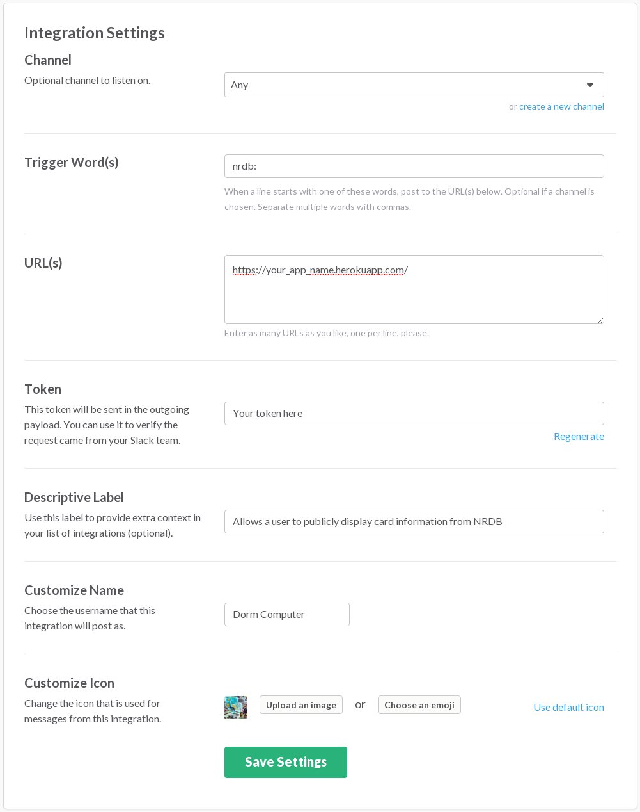
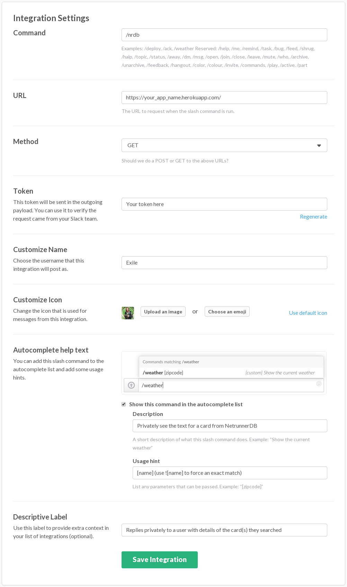
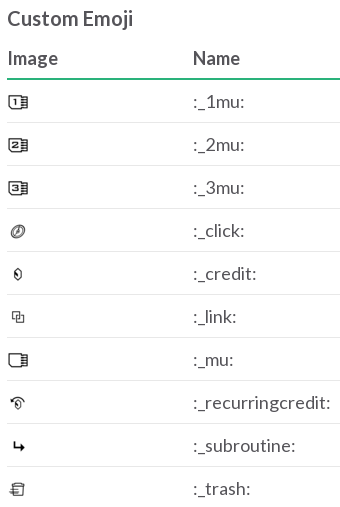

# /nrdb

Search for Netrunner cards from within the comfort of Slack.

## Setup
1. Create a Node.js app on Heroku: https://devcenter.heroku.com/articles/getting-started-with-nodejs

2. In Slack, setup a new outgoing webhook with the following settings:

  * Channel: `Any`
  * Trigger Word(s): `nrdb:`
  * URL(s): Whatever your Heroku app url is.
  * Token: Use whatever it generates for you.

3. In Slack, setup a new slash command with the following settings:

  * Command: `/nrdb`
  * URL: Whatever your Heroku app url is
  * Method: `Get`
  * Token: Use whatever it generates for you.

4. In your Heroku app's settings page, click reveal config vars and enter the following:

  * POST_TOKEN: Whatever token Slack generated in step 2.
  * GET_TOKEN: Whatever token Slack generated in step 3.
  * MAX_HITS: (Optional) The maximum number of cards for the bot to return (NRDB has a limit of 200).

5. grab the Netrunner emoji: https://github.com/frogamic/netrunner-emoji and add them to Slack with the following names:

